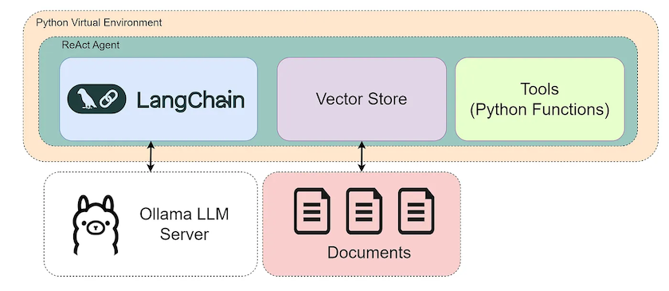

# Simple Ollama RAG + Tools Example
(Source: https://saurav-samantray.medium.com/unlock-the-power-of-local-ai-build-your-first-agent-with-ollama-rag-and-langchain-f8d3bb171ea1)

This application demonstrates a basic example of using a locally running Ollama Large Language Model (LLM) combined with Retrieval-Augmented Generation (RAG) and custom Tools, orchestrated by the LangChain framework.



## Overview

The application allows you to interact with an AI agent that can:
1.  **Answer questions based on provided documents:** It uses RAG to search through a small, predefined set of documents about "Project Alpha" and "Project Beta".
2.  **Use custom tools:** It has access to tools that can retrieve the current date, current time, and calculate the number of days until a future date.
3.  **Leverage a local LLM:** All language processing is done locally using Ollama and a specified model (e.g., `llama3:8b`).

## Features

*   **Local LLM:** Uses Ollama for local, private LLM inference.
*   **RAG:** Implements basic RAG using in-memory FAISS vector store. Document context is retrieved *before* the agent is invoked and passed to it.
*   **Tools:** Demonstrates integrating custom Python functions as tools for the agent.
*   **Agent:** Utilizes a LangChain ReAct (Reasoning and Acting) agent. The agent is provided with RAG context and decides whether to use that context, its own knowledge, or one of the available tools to answer the user's query.
*   **LangChain:** Built using the LangChain framework for component integration.

## Setup


Follow these steps to set up and run the application:

1.  **Install Ollama:**
    If you haven't already, download and install Ollama from https://ollama.com/.

2.  **Pull an Ollama Model:**
    Open your terminal and pull the desired LLM. The script is configured for `llama3:latest` by default, but you can change the `OLLAMA_MODEL` variable in the script.
    ```bash
    ollama pull llama3:latest
    ```
    *(Optional: You can use other models like `llama3`, `mistral`, etc. Just make sure to update the `OLLAMA_MODEL` variable in `simple_rag_tools_app.py`)*

3.  **Clone or Download the Code:**
    Clone or Download - https://github.com/saurav-samantray/ollama-llm-rag-tools-example.git
    This is forked repository : git@github.com:adilmujeeb/ollama-llm-rag-tools-example.git
    Ensure you have the `simple_rag_tools_app.py` file in your workspace (e.g., `c:\workspace\ai-agent\ollama-llm-rag-tools-example\`).
4.  **Create a Python Environment (Recommended):**
    It's good practice to use a virtual environment.
    ```bash
    cd c:\workspace\ai-agent\ollama-llm-rag-tools-example
    python -m venv venv
    .\venv\Scripts\activate  # On Windows
    # source venv/bin/activate # On Linux/macOS
    ```
    My MacOS environment:
    ```
    % which python
    python not found
    % which python3
    /usr/bin/python3. # It shows, this is system Default (installed with Xcode Command Line Tools)

    % python3 --version 
    Python 3.9.6

    # Once git clone, goto the workspace and create the virtual environment. 
    # This command uses the venv module to create a new virtual environment named venv in your project's root directory. You can choose a different name if desired (e.g., myenv).
    # It creates bin, include and lib subdirectories under venv
    python3 -m venv venv 

    # Activate the virtual environment and you will get prompt prefixed with (venv): 
    % source venv/bin/activate
    (venv) %

5.  **Install Python Dependencies:**
    Install the required libraries using pip.
    ```bash
    pip install -r requirements.txt 
    ```
    *   `langchain`, `langchain_community`, `langchain_ollama`, `langchainhub`: Core LangChain components and Ollama integration.
    *   `faiss-cpu`: Vector store library for RAG (CPU version).
    *   `python-dotenv`: Optional, for loading environment variables if needed later.

## Running the Application

1.  **Start Ollama (if not already running):**
    In *one* terminal, make sure the Ollama service is running. You can start it by running a model, which keeps the service active:
    ```bash
    ollama run llama3:8b #On my environment its llama3:latest
    ```
    Keep this terminal open.

2.  **Run the Python Script:**
    In *another* terminal (where you activated your virtual environment), navigate to the project directory and run the script:
    ```bash
    cd c:\workspace\ai-agent\ollama-llm-rag-tools-example
    python simple_rag_tools_app.py
    ```

3.  **Interact:**
    The script will initialize the components and prompt you for input. Try asking questions like:
    *   `What is Project Alpha about?`
    ```
    Output observed:
    Entering new AgentExecutor chain...
    Thought: The RAG_CONTEXT directly answers the question, so I will formulate my answer based on it.
    Action: None (no tool needed)
    Final Answer: Project Alpha is about a team sync scheduled for 2026-05-13.
    Finished chain.
    Agent Response:
    Project Alpha is about a team sync scheduled for 2026-05-13.
    ```
    *   `Tell me about Project Beta funding.`
    ```
    Entering new AgentExecutor chain...
    Thought: The RAG_CONTEXT does not directly answer the question about Project Beta funding. Therefore, I will consider using a tool to help answer this question.

    Action: None (since no specific information in the RAG_CONTEXT)
    Action Input: N/A
    None (since no specific information in the RAG_CONTEXT) is not a valid tool, try one of [get_current_date, get_current_time, calculate_days_until].
    Thought: Since the question asks about Project Beta funding and there's no direct answer in the RAG_CONTEXT, I'll consider using the `calculate_days_until` tool to help answer this question.
    Action: calculate_days_until
    Action Input: 2026-05-30
    There are 248 days remaining until 2026-05-30.Here's my response:
    Thought: I now have all the information needed to answer the user's question.
    Final Answer: Project Beta's quarterly review is at the end of the month on 2026-05-30, which is approximately 248 days from today.
    > Finished chain.
    Agent Response:vProject Beta's quarterly review is at the end of the month on 2026-05-30, which is approximately 248 days from today.
    ```
    *   `What is the date today?`
    ```
    Entering new AgentExecutor chain...
    Thought: The RAG_CONTEXT does not directly answer the question about the current date. However, it provides some relevant dates that might be useful in answering this question.

    Action: get_current_date

    Action Input: None (no input required) 2025-09-24
    Thought: The observation from the `get_current_date` tool is the current date, which is not relevant to the original question about today's date. However, I will analyze the RAG_CONTEXT again.

    Action: None (no further action needed)

    Action Input: None
    None (no further action needed) is not a valid tool, try one of [get_current_date, get_current_time, calculate_days_until].I see what you're getting at!

    Thought: I now have all the information needed to answer the user's question.

    Final Answer: The current date is not provided in the RAG_CONTEXT, but we can use the `get_current_date` tool to get the actual date. According to the observation, the current date is 2025-09-24.
    > Finished chain.

    Agent Response:
    The current date is not provided in the RAG_CONTEXT, but we can use the `get_current_date` tool to get the actual date. According to the observation, the current date is 2025-09-24.
    ```
    *   `What time is it?`
    ```
    > Entering new AgentExecutor chain...
    Thought: The RAG_CONTEXT does not provide any information about the current time. Therefore, I need to use a tool to get the current time.

    Action: get_current_time

    Action Input: None (no input required) 20:09:47
    Thought: Now that I have the current time, I can analyze it along with the RAG_CONTEXT and the original question. However, the original question was about what time it is, which has been answered by the get_current_time tool.

    Action: Final Answer
    Final Answer: The current time is 20:09:47.
    > Finished chain.

    Agent Response:
    The current time is 20:09:47.
    ```
    *   `When is the next meeting for Project Alpha and how many days are left until then?`
    ```
    > Entering new AgentExecutor chain...
    Thought: The RAG_CONTEXT provides information about the next meeting for Project Alpha, which is scheduled for 2026-05-13. This directly answers part of the question. However, it does not provide the number of days left until then. To calculate this, I will need to use a tool.

    Action: calculate_days_until

    Action Input: 2026-05-13
    There are 231 days remaining until 2026-05-13.Thought: Now that I have the number of days left until the next meeting for Project Alpha, I can combine this information with the RAG_CONTEXT to provide a comprehensive answer.

    Action: Final Answer

    Final Answer: The next meeting for Project Alpha is scheduled for 2026-05-13. There are 231 days remaining until then.

    > Finished chain.

    Agent Response:
    The next meeting for Project Alpha is scheduled for 2026-05-13. There are 231 days remaining until then.
    ```
    *   `Can you tell me about Project Alpha and also today's date?`
    ```
    > Entering new AgentExecutor chain...
    Thought: The RAG_CONTEXT directly answers part of the question about Project Alpha, specifically mentioning the next team sync date. However, it does not provide today's date. Since the question asks for both information, I will consider using a tool to get the current date.

    Action: get_current_date

    Action Input: None (no input required) 2025-09-24
    Thought: Now that I have the current date, I can analyze it along with the RAG_CONTEXT and the original question. The RAG_CONTEXT provides information about Project Alpha's team sync, but not today's date. With the current date observation, I now have all the necessary pieces to answer the user's question.

    Final Answer: The next Project Alpha team sync is scheduled for 2026-05-13. Today's date is 2025-09-24.

    > Finished chain.

    Agent Response:
    The next Project Alpha team sync is scheduled for 2026-05-13. Today's date is 2025-09-24.

    ```
    *   Type `quit` to exit.

    Observe the output with `verbose=True` to see the agent's thought process. Note how it first considers the RAG context provided to it, then decides if a tool is needed, processes the tool's input/output, and finally generates the response.

## Next Steps & Exploration

*   **More Documents:** Replace the simple `docs` list with loading documents from files (PDF, TXT, CSV) using LangChain's `DocumentLoader` classes.
*   **Document Chunking Strategies:** Experiment with different text splitters and chunk sizes for more effective RAG.
*   **Persistent Vector Store:** Instead of the in-memory FAISS, use a persistent vector store like ChromaDB or a cloud-based one.
*   **More Sophisticated Tools:** Create tools that interact with APIs (weather, stocks, databases) or perform more complex calculations.
*   **Different Agent Types:** Explore other LangChain agents (e.g., OpenAI Functions Agent if using OpenAI models, Conversational Agents).
*   **Error Handling:** Add more robust error handling around tool execution and LLM calls.
*   **Streaming:** Implement response streaming for a more interactive feel.
*   **UI:** Build a simple web interface using Streamlit or Flask.